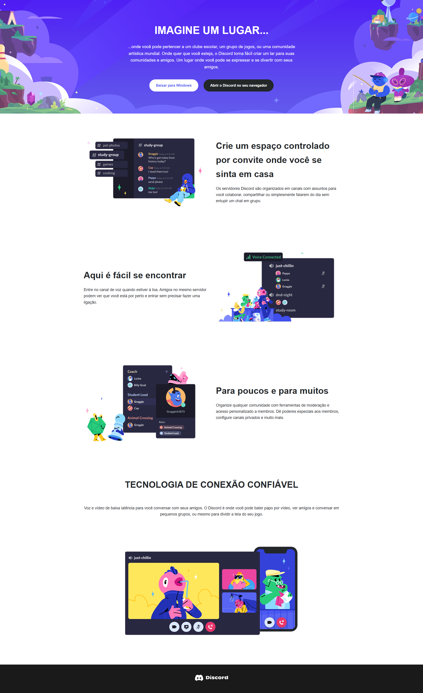

Projeto: Página de Destino do Discord
Este projeto é uma recriação responsiva da página de destino do Discord, desenvolvida utilizando HTML e CSS. O objetivo é replicar o design visual e a adaptabilidade a diferentes tamanhos de tela, conforme observado nas imagens de referência fornecidas.

🚀 Tecnologias Utilizadas
HTML5: Para a estrutura semântica da página.

CSS: Para estilização e responsividade, garantindo um design adaptável a dispositivos móveis e desktops.

✨ Funcionalidades
Design Responsivo: A página se ajusta perfeitamente a diversos tamanhos de tela, desde dispositivos móveis até desktops.

Seções de Conteúdo: Reprodução das principais seções da página original do Discord, incluindo o cabeçalho hero, e blocos de conteúdo com imagens e texto.

Estilo Visual: Cores e tipografia inspiradas no branding do Discord para uma experiência visual autêntica.

Discord
🖥️ Captura de Tela do Site

<!-- Exemplo:  -->

🛠️ Como Executar o Projeto Localmente
Clone o repositório (se estiver em um):

git clone <https://github.com/AlbericoJr/Discord_clone>
cd <Discord_clone>

Abra o arquivo index.html em seu navegador web preferido. Não é necessário um servidor local para este projeto, pois ele consiste apenas em HTML e CSS.

🤝 Contribuição
Contribuições são bem-vindas! Se você tiver sugestões de melhorias ou encontrar algum problema, sinta-se à vontade para abrir uma issue ou enviar um pull request.

📄 Licença
Este projeto está licenciado sob a Licença MIT.